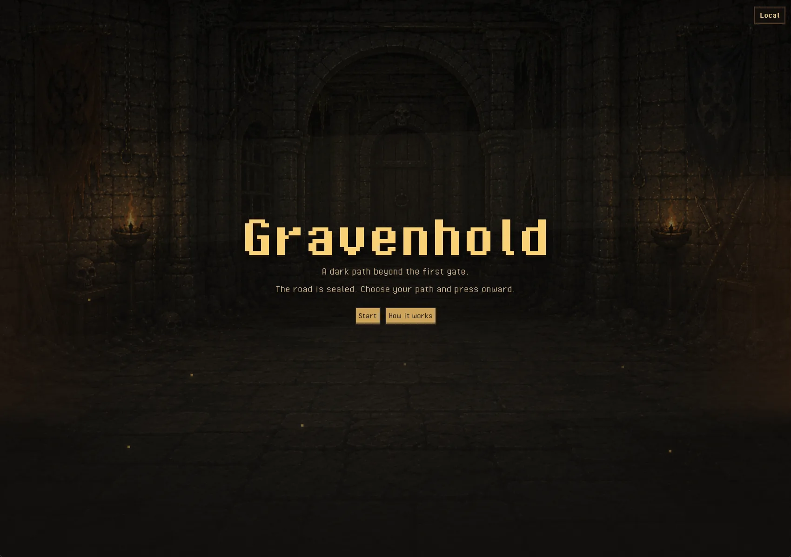
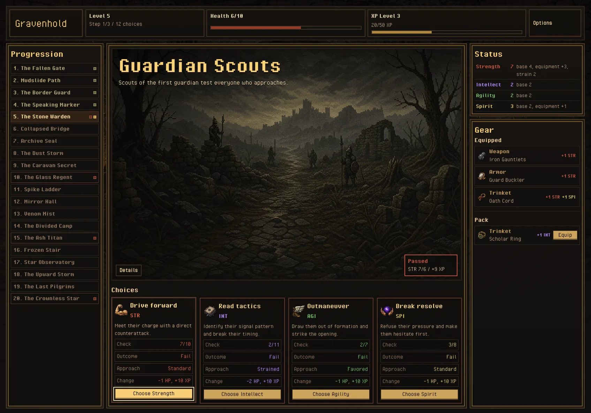
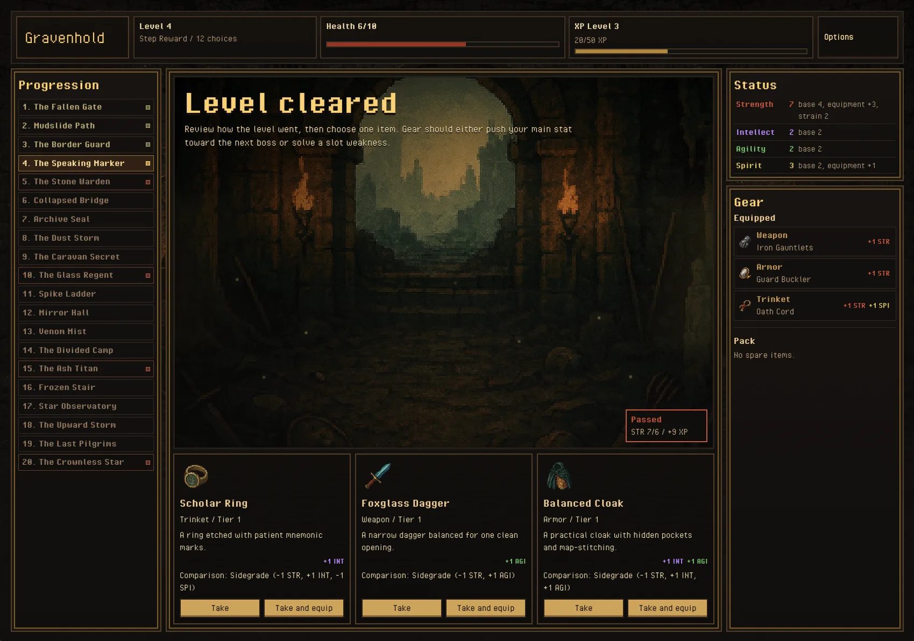
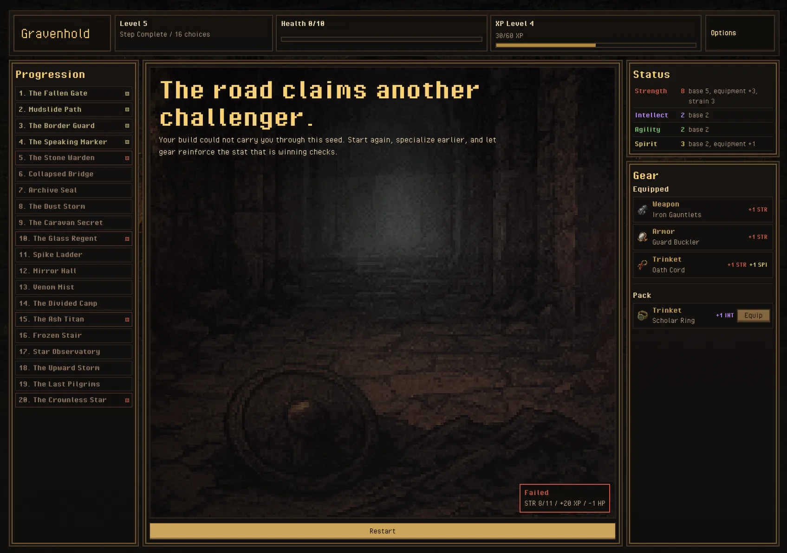

# Gravenhold

An onchain fantasy RPG where every choice carves your path through Gravenhold.

You push through a 20-level path of encounters, earn XP, assign stat points,
equip build-defining gear, and face boss gates that test the character you have
been shaping. Strength, Intellect, Agility, and Spirit each offer a different
way through the same hostile road.

The game runs on Starknet using Dojo and Cairo for onchain gameplay logic, with
a Vite React client for the playable interface.

## Screenshots

<p>
  
  
  
  
</p>

## Project Layout

- `contracts/` - Dojo and Cairo gameplay logic.
- `src/` - Vite React client and chain-state decoding.
- `scripts/` - local chain, deployment, smoke-test, and asset utilities.
- `public/assets/` - game art, UI textures, fonts, and audio.

`manifest_slot.json` is public Slot deployment metadata and is intentionally
committed. Local manifests such as `manifest_dev.json` are machine-specific and
ignored.

## Prerequisites

Versions are pinned in [`.tool-versions`](./.tool-versions):

- Node 20+
- pnpm 10
- scarb 2.15.1
- sozo 1.8.6
- starknet-foundry 0.55.0
- starkli 0.4.2

Install JavaScript dependencies:

```bash
pnpm install
```

## Environment

Copy the example env files when needed:

```bash
cp .env.example .env.local
cp .env.slot.example .env.slot.local
```

Do not commit local env files. `.env.local` is generated by the local chain
script, and `.env.slot.local` is generated by the Slot deploy script.

Image-generation scripts optionally read `OPENAI_API_KEY` and
`OPENROUTER_API_KEY` from local env files. These keys must stay private.

## Local Development

Start a local Katana chain, migrate the dev world, and write `.env.local`:

```bash
npm run dev:chain
```

In another terminal, start the Vite client:

```bash
npm run dev:frontend
```

Open [http://localhost:5173](http://localhost:5173).

## Slot Development

Create or access a Cartridge Slot Katana deployment, then deploy the world:

```bash
curl -L https://slot.cartridge.sh | bash
slot auth login
slot deployments create gravenhold-slot katana -c katana_slot.toml
slot deployments accounts gravenhold-slot katana

SLOT_NAME=gravenhold-slot \
SLOT_ACCOUNT_ADDRESS=0x... \
SLOT_PRIVATE_KEY=<slot-private-key> \
scripts/deploy_slot.sh
```

After the first deploy, run the frontend against Slot:

```bash
pnpm dev:slot
```

See [docs/slot-vercel-runbook.md](./docs/slot-vercel-runbook.md) for the full
Slot and Vercel deployment flow.

## Testing

```bash
npm run generate:display-content
npm run dojo:build
npm run dojo:test
npm run test
npm run lint
pnpm build
```

For a local onchain smoke test:

```bash
npm run dev:chain
npm run smoke:onchain-local
```

Gameplay and balance changes should update Cairo tests and
[docs/new-rpg-doc.md](./docs/new-rpg-doc.md) together.

## Image Assets

Generate first-pass game art with:

```bash
npm run generate:images -- --dry-run
npm run generate:images -- --id fallen-gate
npm run generate:images -- --category items
```

Asset jobs live in `scripts/generate-assets/data/images.json`, prompts live in
`scripts/generate-assets/lib/prompts.ts`, and generated files are saved under
`public/assets/game`.

See [docs/art-direction.md](./docs/art-direction.md) for the visual target and
asset rules.

## Security

Before publishing or rotating deployments:

- Keep `.env*`, private keys, mnemonics, and deployer credentials out of git.
- Treat committed manifests as public deployment metadata only.
- Rotate any credential that was ever committed or shared outside the local
  machine.
- Enable GitHub secret scanning and branch protection in the GitHub repository
  settings.
